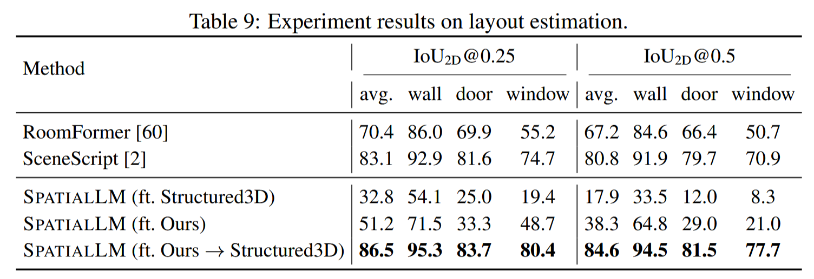

## Sturctured3D 结果复现

官方论文结果如下：

所有指标均在 structured3d 测试数据集上测试，记录 F1@0.5IoU 指标：

| Model                  | FT Datset      | Test Dataset | wall  | door  | window | Avg   | Note                   | Config                                                                        |
| ---------------------- | -------------- | ------------ | ----- | ----- | ------ | ----- | ---------------------- | ----------------------------------------------------------------------------- |
| SpatialLM1.1-Qwen-0.5B | spatiallm-data | s3d          | 67.96 | 34.15 | 22.03  | 41.38 | Official               |                                                                               |
| SpatialLM1.1-Qwen-0.5B | spatiallm-data | s3d-pzhang   | 67.09 | 34.00 | 34.82  | 45.30 | Official               |                                                                               |
| SpatialLM1.1-Qwen-0.5B | s3d            | s3d          | 93.46 | 81.52 | 75.69  | 83.56 | Official               | [model](https://huggingface.co/ysmao/SpatialLM1.1-Qwen-0.5B-Structured3D-SFT) |
| SpatialLM1.1-Qwen-0.5B | s3d            | s3d-pzhang   | 92.16 | 59.29 | 18.96  | 56.80 | Official               |                                                                               |
| SpatialLM1.1-0.5B-sft  | s3d-pzhang     | s3d          | 92.82 | 73.60 | 32.10  | 66.17 |                        | [config](configs/spatiallm_sft_structured3d.yaml)                             |
| SpatialLM1.1-0.5B-sft  | s3d-pzhang     | s3d-pzhang   | 91.93 | 63.19 | 50.73  | 68.62 |                        |                                                                               |
| SpatialLM1.1-0.5B-sft  | s3d-pzhang     | s3d-pzhang   | 91.92 | 93.92 | 89.34  | 91.73 | fix scale and eval bug |                                                                               |

Note:
- `SpatialLM1.1-Qwen-0.5B`: SpatialLM 官方模型
- `SpatialLM1.1-0.5B-sft`: 在 `SpatialLM1.1-Qwen-0.5B` 模型基础上，采用 `spatial-structured3d-pzhang` 数据集进行微调的模型
- `spatiallm-data`: 为 SpatialLM 论文中所用到的数据，未公开
- `s3d`: 为作者提供的转换好的 Structured3d 数据集，其中的门和窗高度为所在墙面的高度
- `s3d-pzhang`: 我们重新处理后的 Structured3d 数据集，门和窗的高度为实际高度，同时修复了一些数据错误
- 作者对s3d复现的提示：https://github.com/manycore-research/SpatialLM/issues/79#issuecomment-3146998014

## HC3D 数据训练

采用 `data_preprocess/HC3D/` 下的说明进行数据处理后，即可开始进行训练。

有效数据 8 套，训练 500 iterations，训练集上指标如下：

| Model             | FT Dataset | Test Dataset | wall  | door  | window | Avg   | Note  |
| ----------------- | ---------- | ------------ | ----- | ----- | ------ | ----- | ----- |
| SpatialLM1.1-0.5B | HC3D       | HC3D         | 92.27 | 96.15 | 97.92  | 95.45 | 5cm   |
| SpatialLM1.1-0.5B | HC3D       | HC3D         |       |       |        |       | 2.5cm |

## 训练优化

官方在 s3d 数据上微调训练时，`num_bins` 设置为 640，结合 `spatiallm/layout/entity.py` 中的 `NORMALIZATION_PRESET` 参数，
可计算出其对点云的网格划分最小为 `32/640=0.05m`，该精度无法满足室内布局估计 2 到 5 cm的精度要求。

以下实验均基于 `SpatialLM1.1-0.5B` 模型，采用 `s3d` 数据集进行训练，在 RTX 5090D 32GB 显卡下进行：

- `per_device_train_batch_size=1`

| num_bins | resulution | Peak Mem | train prec                 | Note         |
| -------- | ---------- | -------- | -------------------------- | ------------ |
| 640      | 0.05       | OOM      | fp32                       | 101 step OOM |
| 640      | 0.05       | OOM      | MLP+LLM bf16               | 288 step OOM |
| 640      | 0.05       | OOM      | bf16,cutoff_len=4096       | 288 step OOM |
| 640      | 0.05       | OOM      | bf16,cutoff_len=4096,zero2 | 101 step OOM |

