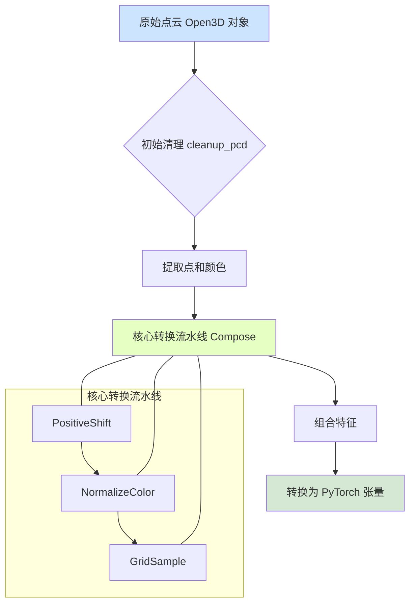

# SpatialLM 数据预处理流程分析

`SpatialLM` 的数据预处理流程旨在将原始的 3D 点云数据（通常是 `.ply` 文件）转换成模型能够理解和处理的标准化张量格式。这个过程不仅涉及几何坐标的处理，还包括颜色信息的归一化和数据增强。

整个流程可以分为两个主要阶段：**初始清理（可选）** 和 **核心转换流水线**。

## 1. 流程概览

以下是数据从原始文件到模型输入的完整流程图：

## 2. 详细步骤解析

### 阶段一：加载与初始清理 (可选)

这个阶段在 [`inference.py`](inference.py:287) 的主循环中被调用，主要目的是减少点云的密度并移除噪声。

1.  **加载点云**:
    *   使用 `open3d` 库从 `.ply` 文件加载点云数据。
    *   通过调用 [`spatiallm/pcd/pcd_loader.py:load_o3d_pcd`](spatiallm/pcd/pcd_loader.py:9) 实现。

2.  **点云清理 (`cleanup_pcd`)**:
    *   这是一个可选步骤，由 `--no_cleanup` 参数控制。
    *   **体素下采样 (`voxel_down_sample`)**: 将点云栅格化，每个体素（Voxel）内只保留一个点（通常是所有点的质心），从而显著降低点云的密度，统一其空间分辨率。`voxel_size` 与模型的 `grid_size` (网格大小) 保持一致。
    *   **统计离群点移除 (`remove_statistical_outlier`)**: 对每个点，计算其到 N 个最近邻点的平均距离。如果这个平均距离大于所有距离的全局平均值加上一个标准差的倍数（由 `std_ratio` 定义），那么这个点就被认为是离群点并被移除。这能有效地清除由传感器噪声或重建错误引入的孤立点。

3.  **提取坐标和颜色**:
    *   从 Open3D 对象中分别提取点的 XYZ 坐标 (`points`) 和 RGB 颜色 (`colors`) 作为 `numpy` 数组。
    *   [`get_points_and_colors`](spatiallm/pcd/pcd_loader.py:14) 函数会进行检查，确保颜色值在 `[0, 255]` 的 `uint8` 范围内。

### 阶段二：核心转换流水线

这个阶段定义在 [`inference.py`](inference.py:22) 的 [`preprocess_point_cloud`](inference.py:22) 函数中。它使用了一个 `Compose` 对象，串联了多个转换操作，这些操作定义在 [`spatiallm/pcd/transform.py`](spatiallm/pcd/transform.py:1)。

1.  **`PositiveShift`**:
    *   **作用**：确保所有点的坐标都是正数。
    *   **实现**：计算整个点云在 X, Y, Z 轴上的最小坐标值，然后从所有点的坐标中减去这个最小值。这使得点云的包围盒的最小角点与坐标原点 `(0,0,0)` 对齐，但不会改变点云的相对几何结构。

2.  **`NormalizeColor`**:
    *   **作用**：将颜色值归一化。
    *   **实现**：将 `[0, 255]` 范围的 RGB 颜色值线性映射到 `[-1, 1]` 的浮点数范围。计算公式为 `color / 127.5 - 1`。这种归一化有助于模型在训练时更好地处理颜色特征。

3.  **`GridSample` (核心步骤)**:
    *   **作用**：这是预处理中最关键的一步，它将连续的点云空间离散化为规则的网格，并对每个网格单元进行采样。
    *   **实现流程**:
        1.  **计算网格坐标 (`grid_coord`)**: 将每个点的真实坐标（已经被 `PositiveShift` 处理过）除以 `grid_size`，然后向下取整，得到每个点所在的离散网格索引 `(gx, gy, gz)`。
        2.  **哈希编码**: 将三维的网格坐标 `(gx, gy, gz)` 通过一个哈希函数（默认为 `fnv_hash_vec`）转换成一个唯一的 64 位整数 `key`。这使得具有相同网格坐标的点（即落在同一个体素内的点）拥有相同的哈希值。
        3.  **排序与分组**: 根据哈希键对所有点进行排序。这样，属于同一个网格单元的点就会被排在一起。
        4.  **采样**: 在**测试模式（test mode）**下，对于每个非空的网格单元，它会选择该单元内所有点的**中间**一个点作为代表。这是一种确定性的采样策略，确保每次运行结果一致。而在训练模式下，它会随机选择一个点。
        5.  **特征保留**: 只有被选中的采样点的特征（如原始坐标、归一化后的颜色）会被保留下来，传递给下一阶段。

### 阶段三：组合与输出

1.  **组合特征**:
    *   在 [`preprocess_point_cloud`](inference.py:22) 函数的最后，将采样后得到的 **离散网格坐标 (`grid_coord`)**, **连续的世界坐标 (`xyz`)** 和 **归一化的颜色 (`rgb`)** 沿特征维度拼接起来。
    *   最终形成的特征向量为 `[gx, gy, gz, x, y, z, r, g, b]`，维度为 `(N_sampled_points, 9)`。

2.  **转换为张量**:
    *   将拼接好的 `numpy` 数组转换为 `PyTorch` 张量，并增加一个批处理维度，使其形状变为 `(1, N_sampled_points, 9)`，这便是最终输入给模型的点云数据。

通过这一系列复杂的处理，`SpatialLM` 成功地将任意大小和密度的原始点云，转换成了具有固定结构和数量特征的、适合深度学习模型处理的张量。