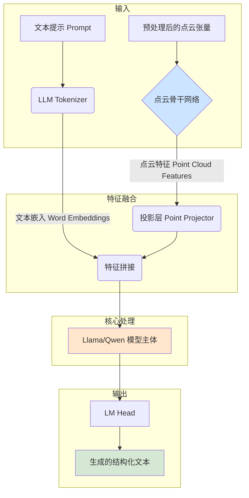

# SpatialLM 模型架构分析

`SpatialLM` 的核心是一个多模态模型，它创新性地将一个强大的 **3D 点云编码器** 与一个 **大型语言模型 (LLM)** 相结合。这种设计使得模型不仅能“看懂”三维空间几何信息，还能利用 LLM 的推理和生成能力，将理解结果以结构化的文本格式输出。

## 1. 整体架构

模型的核心架构定义在 [`spatiallm/model/spatiallm_llama.py`](spatiallm/model/spatiallm_llama.py) (或 `spatiallm_qwen.py`) 文件中的 `SpatialLMLlamaForCausalLM` 类中。其工作流程可以概括为以下几个步骤：

### 关键组件：

1.  **点云骨干网络 (Point Cloud Backbone)**: 负责将输入的点云张量编码成一系列高级特征向量。`SpatialLM` 支持两种不同的骨干网络：
    *   **SceneScript Encoder**: 用于 `SpatialLM v1.0`。
    *   **Sonata Encoder**: 用于 `SpatialLM v1.1`，性能更强。
2.  **投影层 (Projector)**: 一个简单的线性层或小型 MLP（多层感知机），用于将点云骨干网络输出的特征向量投影到与 LLM 的词嵌入空间相同的维度。这是连接 3D 视觉模块和语言模块的关键桥梁。
3.  **大型语言模型 (LLM)**: `SpatialLM` 基于预训练的 `Llama` 或 `Qwen` 模型进行构建。它接收拼接后的文本和点云特征，并自回归地生成最终的结构化输出。

## 2. 点云骨干网络详解

点云骨干网络是模型的“眼睛”，负责从原始点云中提取有意义的几何和语义特征。

### A. SceneScript 编码器 ([`scenescript_encoder.py`](spatiallm/model/scenescript_encoder.py))

这是 `SpatialLM v1.0` 使用的编码器，基于稀疏卷积网络（Sparse CNN）构建。

*   **核心模块**: `ResNet3DSparse`。
*   **工作原理**:
    1.  **稀疏卷积**: 使用 `torchsparse` 库对输入的稀疏体素化点云进行 3D 卷积。通过一系列的 `ResBlockSparse` 和降采样卷积层，逐步扩大感受野，提取多尺度的层级特征。
    2.  **序列化 (`vox_to_sequence`)**: 将最终的稀疏特征图转换为一个密集的序列。每个序列元素对应一个非空体素，包含了该位置的特征向量和坐标。
    3.  **位置编码**: 为了让模型理解点的位置，它将每个体素的**归一化坐标**通过**傅里叶编码 (Fourier Encoding)** 转换成高维的位置嵌入，并与特征向量拼接。
    4.  **最终投影**: 一个线性层将拼接后的特征投影到最终的输出维度。
*   **输出**: 一个上下文张量 `context` (形状 `[B, maxlen, d_model]`) 和一个 `context_mask`，表示序列中的哪些位置是有效的（非填充）。

### B. Sonata 编码器 ([`sonata_encoder.py`](spatiallm/model/sonata_encoder.py))

这是 `SpatialLM v1.1` 使用的更先进的编码器，基于 Point Transformer V3 架构，引入了序列化注意力机制。

*   **核心思想**: 将无序的点云通过**空间填充曲线（Space-Filling Curves）**，如 Z-order 或 Hilbert 曲线，进行序列化。这使得 3D 空间中邻近的点在 1D 序列中也尽可能靠近，从而可以高效地应用 Transformer 的注意力机制。
*   **关键步骤**:
    1.  **序列化 (`serialization`)**: 使用 [`spatiallm/model/serialization/default.py`](spatiallm/model/serialization/default.py) 中的 `encode` 函数，将每个点的离散网格坐标转换成一个 64 位的整数编码。支持多种排序方式（`z`, `hilbert` 等），以增强模型的鲁棒性。
    2.  **分块注意力 (`SerializedAttention`)**:
        *   将排序后的点云序列分割成固定大小的、不重叠的“块”（Patch）。
        *   在每个块内部独立地执行标准的多头自注意力（Multi-Head Self-Attention）。这极大地降低了计算复杂度，因为注意力只在局部块内计算，而不是全局计算。
        *   `Sonata` 可以选择性地开启 Flash Attention 来进一步加速计算。
    3.  **层级结构**: 与 SceneScript 类似，Sonata 也通过一系列的 `GridPooling`（降采样）操作和 `Block`（Transformer 块）构建了一个层级式的编码器，从局部到全局提取特征。
*   **输出**: 一个单一的特征张量，代表了整个点云的上下文信息。

## 3. 前向传播 (`forward`) 流程

模型的 `forward` 方法（位于 [`spatiallm_llama.py`](spatiallm/model/spatiallm_llama.py)）清晰地展示了多模态融合的过程：

1.  **编码点云**: 调用 `self.forward_point_cloud` 方法，使用选定的点云骨干网络（Sonata 或 SceneScript）将输入的 `point_clouds` 张量编码为点云特征 `point_feature`。

2.  **编码文本**: 使用 LLM 自带的 `embed_tokens` 方法将 `input_ids` (文本提示) 转换为词嵌入 `inputs_embeds`。

3.  **特征注入**: 这是最关键的一步。
    *   代码会遍历批次中的每一个样本，找到文本提示中的特殊标记 `<|point_start|>` 和 `<|point_end|>`。
    *   它将这两个标记之间的 placeholder（即 `<|point_pad|>`）替换为经过投影层处理后的完整点云特征序列。
    *   通过 `torch.cat` 将 `start` 标记前的文本嵌入、点云特征嵌入、`end` 标记后的文本嵌入拼接成一个新的、更长的嵌入序列 `new_input_embeds`。
    *   同时，也为新插入的点云特征更新 `attention_mask`，确保它们在后续的注意力计算中被考虑。

4.  **LLM 处理**: 将拼接好的 `inputs_embeds` 和更新后的 `attention_mask` 传入 Llama/Qwen 模型的主体部分。模型会像处理普通文本一样处理这个融合了 3D 信息的序列。

5.  **生成结果**: 模型输出的 `hidden_states` 经过 `lm_head` 投影到词汇表大小，生成 logits，最终解码为结构化的文本输出。

通过这种“特征注入”的方式，`SpatialLM` 将 3D 空间的几何信息无缝地融入到了 LLM 的处理流程中，赋予了语言模型强大的 3D 理解能力。