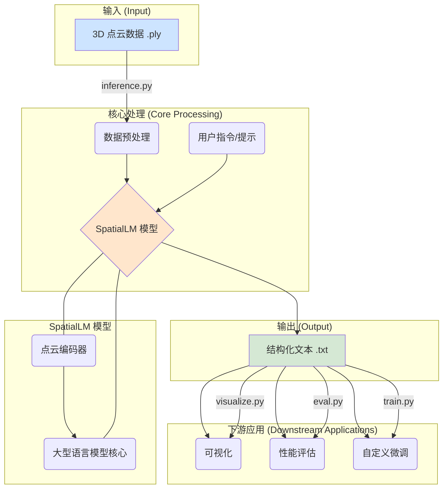

# SpatialLM 项目分析报告

## 1. 项目概述

`SpatialLM` 是一个专为 **3D 室内场景理解** 而设计的大型语言模型（LLM）。它的核心目标是将非结构化的 3D 点云数据，转换为结构化的、包含丰富语义信息的 3D 场景表示。

具体来说，该项目能够：

*   **处理多种来源的 3D 点云**：无论是通过单目视频、RGBD 图像还是激光雷达（LiDAR）传感器生成的点云，`SpatialLM` 都能有效处理。
*   **生成结构化的 3D 布局**：模型可以识别并输出场景中的建筑元素，如 **墙壁（walls）**、**门（doors）** 和 **窗户（windows）**。
*   **进行 3D 对象检测**：除了建筑布局，模型还能检测场景中的家具和其他物体（如床、沙发、柜子等），并提供它们的 **三维边界框 (bounding boxes)** 和 **语义类别**。
*   **支持用户自定义检测**：`SpatialLM 1.1` 版本引入了新功能，允许用户指定感兴趣的物体类别进行检测，这极大地增强了应用的灵活性。

总而言之，`SpatialLM` 旨在弥合非结构化 3D 几何数据与结构化 3D 场景表示之间的鸿沟，为具身智能（Embodied AI）、自主导航和复杂的 3D 场景分析等应用提供强大的空间推理能力。

## 2. 项目架构和技术栈

`SpatialLM` 的实现依赖于一个复杂但组织良好的代码库。以下是其关键组件的图解和说明：

### 主要模块分析：

*   **`spatiallm/`**: 项目的核心代码目录。
    *   **`model/`**: 存放模型定义的地方。
        *   `spatiallm_llama.py` / `spatiallm_qwen.py`: 定义了 `SpatialLM` 的主要模型架构，它将一个 **点云编码器**（如 Sonata 或 SceneScript）与一个 **大型语言模型**（如 Llama 或 Qwen）结合起来。
        *   `serialization/`: 包含了将三维坐标序列化为模型可以理解的离散 token 的方法。
    *   **`pcd/`**: 包含了点云加载、预处理和转换的工具函数。
    *   **`layout/`**: 定义了 `Layout` 类和各种场景实体（如 `Wall`, `Door`, `Bbox`），用于解析和表示模型输出的结构化文本。
    *   **`tuner/`**: 包含了用于模型微调（fine-tuning）的完整框架，包括数据加载、训练器、参数配置等。

*   **`configs/`**: 存放模型训练和微调的配置文件（例如 `spatiallm_sft.yaml`）。

*   **根目录脚本**:
    *   [`inference.py`](inference.py:1): **推理脚本**。用于加载预训练好的 `SpatialLM` 模型，处理输入的点云文件，并生成描述场景结构的文本文件。
    *   [`train.py`](train.py:1): **训练脚本**。用于在自定义数据集上对模型进行微调。它支持分布式训练。
    *   [`eval.py`](eval.py:1): **评估脚本**。将模型预测的布局与真实的标注（ground truth）进行比较，计算 F1 分数等性能指标。
    *   [`visualize.py`](visualize.py:1): **可视化脚本**。使用 `rerun-sdk` 工具将输入的点云和模型预测的 3D 布局进行可视化，方便直观地检查结果。

### 技术栈：

*   **深度学习框架**: [`PyTorch`](pyproject.toml:11)
*   **核心模型库**: [`transformers`](pyproject.toml:14) (Hugging Face)
*   **3D 数据处理**: [`open3d`](pyproject.toml:28), [`numpy`](pyproject.toml:18), `bbox`
*   **依赖管理**: [`poetry`](pyproject.toml:1)
*   **可视化**: [`rerun-sdk`](pyproject.toml:24)

## 3. 工作流程

`SpatialLM` 的典型工作流程如下：

1.  **数据准备**:
    *   输入一个或多个 `.ply` 格式的 3D 点云文件。这些点云通常是经过轴对齐的（Z 轴朝上）。
    *   `README.md` 中提到了使用 [MASt3R-SLAM](https://github.com/rmurai0610/MASt3R-SLAM) 从 RGB 视频重建点云作为示例。

2.  **执行推理**:
    *   运行 [`inference.py`](inference.py:1) 脚本。
    *   脚本首先加载指定的 `SpatialLM` 模型和 Tokenizer。
    *   接着，它会对输入的点云进行 **预处理**，包括体素下采样、颜色归一化和网格采样，将其转换为模型可以接受的张量格式。
    *   然后，它会根据用户指定的任务类型（例如，是检测所有物体、仅检测建筑结构还是仅检测物体）构建一个 **提示（Prompt）**。
    *   将预处理后的点云张量和文本提示一起输入模型。
    *   模型以流式（streaming）的方式生成描述场景布局的文本。

3.  **处理输出**:
    *   模型输出的是一种类似代码的专有格式文本，每一行代表一个场景实体（如 `wall(...)`, `door(...)`, `bbox(...)`）。
    *   [`inference.py`](inference.py:1) 会将这些文本中的离散坐标值进行反归一化，还原为真实的物理坐标，并将其保存为 `.txt` 文件。

4.  **评估与可视化**:
    *   **可视化**: 运行 [`visualize.py`](visualize.py:1) 脚本，该脚本可以读取原始点云和预测的 `.txt` 布局文件，生成一个 `.rrd` 文件，然后使用 `rerun` 命令进行 3D 可视化。
    *   **评估**: 如果有真实的标注数据，可以运行 [`eval.py`](eval.py:1) 脚本，通过计算预测实体和真实实体之间的 IoU（交并比）来评估模型的准确性。

## 4. 总结与展望

`SpatialLM` 是一个强大而前沿的项目，它成功地将大型语言模型的文本生成和理解能力引入到了 3D 空间理解领域。通过将点云编码进 LLM 的表示空间，它不仅能识别物体，还能理解它们之间的空间关系和场景的整体结构。

该项目的代码结构清晰，模块化程度高，并且提供了从推理、评估到微调的完整工具链，非常适合研究人员和开发者在此基础上进行扩展和应用。

**潜在应用方向包括**：
*   **室内设计与增强现实 (AR)**：快速生成现有房间的数字孪生模型。
*   **机器人与自主导航**：帮助机器人更好地理解和导航复杂的室内环境。
*   **自动化资产管理**：自动盘点和定位大型仓库或建筑内的物体。